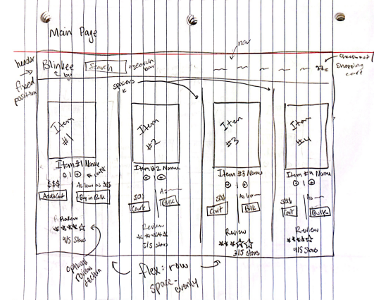
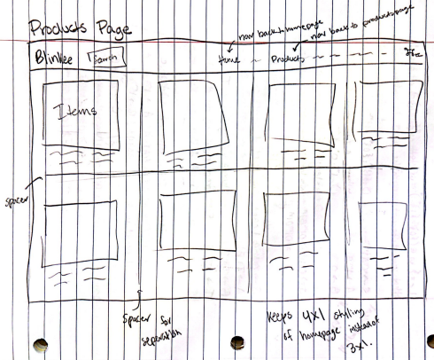
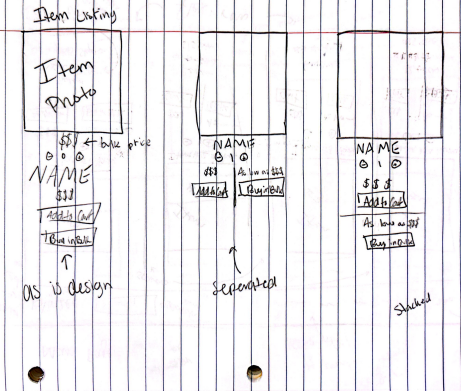
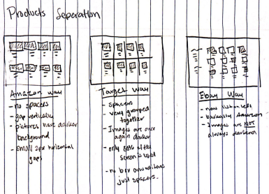
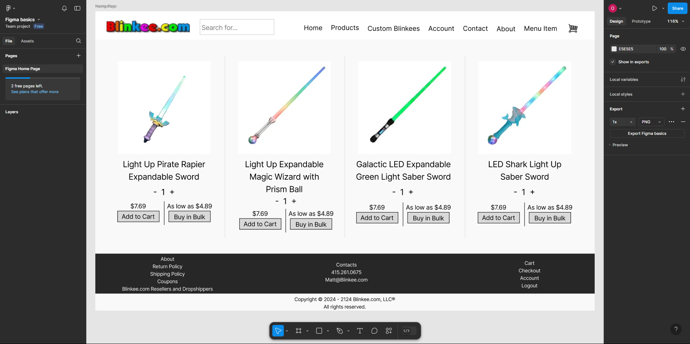
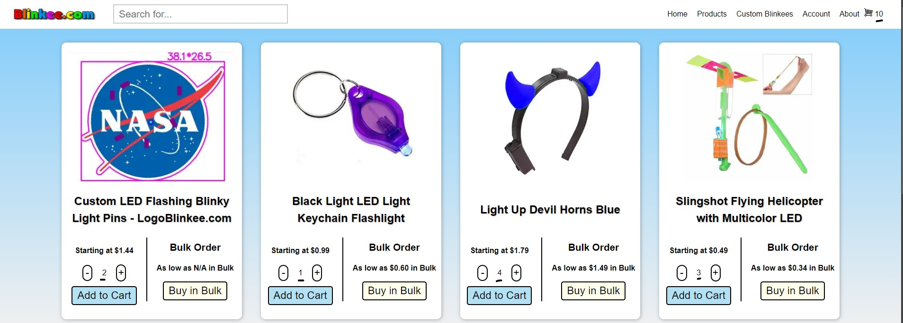
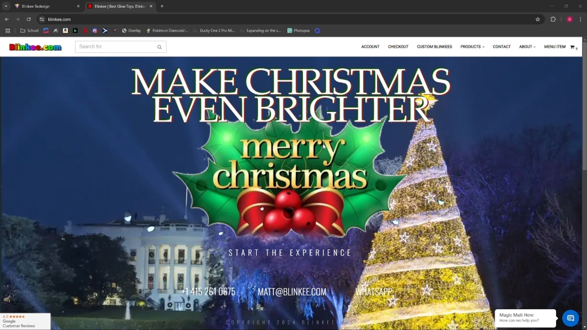

# User_Interface_Project_3
Members: Sam Weese, William Braun, Owen Richards, and Nathan Suer

# [Link to the source code on github](https://github.com/NSuer/User_Interface_Project_3)

# [Link to the publicly hosted application](https://nsuer.github.io/User_Interface_Project_3/)

(Our Pictures don't work, see demo video or download code to see them)

# Description of the project
Our redesign of [Blinkee](https://blinkee.com/) focused on enhancing the user experience by streamlining the interface and reducing visual clutter. The primary goal was to create a clean, modern, and minimalistic website that prioritizes user engagement while avoiding unnecessary distractions. The updated design ensures that users can seamlessly navigate the platform, easily find their desired products, and customize Blinkees without feeling overwhelmed. This redesign combines functionality with aesthetics to provide an enjoyable shopping experience for Blinkee’s audience, ensuring that the platform is both engaging and effective.

Key features of the redesign include:
- Simplified Layout: We reorganized the site structure to make navigation intuitive and visually appealing with emphasis on clarity and ease of use.
- Redesigned custom Blinkee Creator: A dedicated, user-friendly tool allows customers to design their own custom Blinkees, offering a personalized experience with minimal friction.

# Design Work
## 1. Choose a UI to fix
We decided to redesign the Blinkee website, https://blinkee.com/. We believe the issues with the Blinkee website center around usability and design concerns. As such, we will attempt to remedy the below issues as well as possible in our demo. 

On first glance, we noticed several things that could be improved, including:
- "Qty Discount" Button - They displayed the price for this with the label "Bulk." They should use the same wording to keep correlation.
- Footer - The whole footer is a mess. It takes up half of the screen, two long vertical lists, duplicate navigation buttons (Checkout, My Account/Account), and the Home navigation only at the bottom.
- They added a Christmas theme to the home page that moves and is very distracting. The theme linked to their Christmas themed blinkees but why wouldn't that be on the main page?
- "Custom Blinkee" - Button in the navigation leads to a completely new website with no way to get back aside from using the back button built into one's search engine.
- Products Page - This page is not structured well. It fails to stick with the four items per row layout of the main page, and it can be somewhat hard to differentiate between the different items.

## 2. Redesign research, data, planning

Chosen Methods
- Expert heuristic evaluation
    - To complete this method, we will read through each of the linked articles on the “Heuristic evaluation” Canvas page. After reading through each of the heuristics, we will determine which are most applicable to our chosen website. We will then determine if each of the chosen guidelines is addressed by the current website. For those that are not yet addressed, we will figure out the best way to implement them in our redesign.

    - Chosen Heuristics
        - Visibility of System Status
            - This guideline is prevalent throughout the website, as it is always important to let the user know where they are. This guideline is addressed by the "You Are Here:" text on every page of the website (aside from the home page). However, when the user clicks on the "Custom Blinkees" menu item in the navigation bar, they are taken to a new website. While the site does look different, it can be a bit difficult to realize it is a completely new website at first. In this case, the user is not notified of where they are. In our redesign, we will either make the LogoBlinkee.com site be built into the original Blinkee.com website or have a message that shows the user was taken to a new website. 

        - User Control and Freedom
            - This guideline is prevalent any time the user starts a process or does an action. Blinkee.com does support the undo and redo buttons on one's search engine, but there are not many "exits" built into the site itself. On the checkout page, there is no clear cancel button. The user can adjust the quantity of an item being ordered or completely remove it, but navigating away from this page requires the user to either click "blinkee.com" after the "You Are Here:" text or use the navigation bar to access a different page. Another example of where this guideline needs to be addressed is what happens when the user clicks the "Custom Blinkee" menu item. This button takes the user to a completely different website with no options to return to Blinkee.com without pressing the undo button offered by the search engine. To address this guideline, we will include cancel, exit, or undo buttons on almost every page to ensure the user never gets stuck and always has a clear exit. 

- Observational study with a think aloud protocol
    - To complete this method, we will recruit at least three participants and have them complete a series of tasks on the current Blinkee website. Because this website could be used by a wide variety of people, we will attempt to have some variation in our participants, especially in terms of age. The set tasks could include things such as ordering a certain item, making a custom Blinkee, navigating the shopping cart, and more. We will record the screen as participants work through these tasks, and we will ask them to think aloud as they do so. After all of the participants complete the study, we will compare what they said while completing the tasks to best identify difficulty points. 

    - Tasks: 
        1. Add 3 "Multicolor Star Infinity Tunnel Necklaces" to the shopping cart.
        2. Add at least 1 "Masquerade Silver Unlit Metallic Mask Mardi Gras" to the shopping cart.
        3. Navigate to the shopping cart. From here, remove all of the "Multicolor Star Infinity Tunnel Necklaces" and add at least 1 "Masquerade Silver Unlit Metallic Mask Mardi Gras." Make sure these changes are reflected in the cumulative price of all the items in the shopping cart. 
        4. Navigate to the "Custom Blinkees" page. Start the process of creating a custom Blinkee by uploading an image to the correct page. Add at least one LED to the custom page and make the LED fade. Once finished with the custom Blinkee, return to the original website without using your search engine's browser. 
        5. Find the return policy for Blinkee.com and start a return. 

    - Process:
        - To carry out this study, three participants of differing ages were asked to complete the above tasks while thinking aloud. The first participant was a high school-aged male. The second participant was a middle-aged female. The third participant was a college-aged male. The screen and audio were recorded while the participants completed said tasks so we could compare what they said and did to best identify difficulty points. 

    - Results:
        - The first participant had difficulty completing the first task. This difficulty was likely caused by a combination of his inexperience with shopping websites and him being a little unclear on what he could use to complete the tasks. He spent roughly five minutes scrolling through the products on the webpage with no luck in finding the desired product. Once it was restated that he could use anything on the website, including search bars, he quickly made use of the search bar to find the product. He had no issues completing the second task. For the third task, he first navigated to checkout before finding the shopping cart. He also did not realize that the button "Update Cart" had to be clicked before changes made in the cart were reflected in the price. For the fourth task, he had no issues creating a custom Blinkee. He was unable to find a way to return to the original website without using the browser's back button. He had no issues completing the fifth task.

        - The second participant had no difficulty completing the first task, although she did start by scrolling through the products page before quickly changing her mind and using the search bar. She had no trouble completing the second task. She had no trouble with the third task, although she did decrease the quantity of the necklace to 0 rather than using the "X" button, which was centered above the item. While doing so, she stated that there should be a trash can next to the item to allow for quick removal. This participant had trouble finding where to create a custom blinkee on the "LogoBlinkee.com" website. She stated that this option should have been centered on the home page to allow for quick navigation. After a few minutes of scrolling, she clicked on "Free Quote" on the home page and believed she was on the desired page. After a few hints as to where she needed to go, she was able to find the "Build a Blinky" page. After doing so, she again restated that there should have been a more prominent button to allow for easier navigation to this page. For the fourth task, she did not realize that she was on a different website. After being told that she was on a different website, she was unable to return to the original website without using the browser's back button. She had no issues completing the fifth task, although she did state that the text that linked to the return policy should have been a different color. 

        - The third participant had no difficulty completing the first task, although he did start by scrolling through the products page before quickly changing his mind and using the search bar. When completing the second task, the item would not autocomplete in the search bar. Therefore, he decided to use the products page to find the mask, which took quite a bit longer than it would have had the search bar autocompleted. He had no trouble completing the third task, although he did decrease the quantity of the necklace to 0 rather than using the "X" button, which was centered above the item. He had no trouble creating a custom Blinkee for the fourth task, although he did not see the "Upload File" button initially and began dragging LEDs onto the white space on the page. He was able to find a way to return to the original website by going through the reviews, then clicking on a review titled "Blinkee.com". He then clicked on "Blinkee.com" on the line "Review of Blinkee.com". This page brought up a link to the Blinkee.com website. This solution was not intended, and he commented on how it should be easier to get to the original website without having to go through these steps. He had no trouble completing the fifth task, although he did state that the link to the return policy should be easier to see.  

    - Conclusion:
        - Both the first and second participant independently asked if Blinkee.com was a real website. After being told that it was, they both said that the website "sucked." They both had several displeasures with the website. All of the users struggled to find products easily without using the search bar. Two of the participants stuggled with the navigation between the different webpages, mostly due to not having a clear path back to "home". Two of the participants also strugged using the custom blinkee page, one due to not noticing the "Upload File" button and the other due to not being able to navigate back to the actual Blinkee website. Finally, two of the participants missed the "X" button that would have been a shortcut to removing items from their shopping cart. 

- System Usability Scale
    - To complete this method, we will make a questionnaire that contains all ten of the SUS statements. We will ask the participants from the observational study to complete this questionnaire after they finish with the tasks. We will then follow the steps outlined by the linked website on the Canvas page to score this UI and determine how good its usability is. This overall score, along with the scores for each of the individual statements, will help us evaluate the usability of the site and identify areas for improvement.

    - Questionnaire: https://docs.google.com/forms/d/e/1FAIpQLSf_jZzDSNIZvfFB4CkvMpjwsvOJp8bPbNUije5bH_2pf06zrQ/viewform?usp=sf_link

    - Results:
        - Participant 1:
            Statement 1:  2 - 1 = 1 
            Statement 2:  5 - 5 = 0
            Statement 3:  3 - 1 = 2
            Statement 4:  5 - 4 = 1
            Statement 5:  5 - 1 = 4
            Statement 6:  5 - 1 = 4
            Statement 7:  3 - 1 = 2
            Statement 8:  5 - 4 = 1
            Statement 9:  3 - 1 = 2
            Statement 10: 5 - 5 = 0
            Total Score = 1 + 0 + 2 + 1 + 4 + 4 + 2 + 1 + 2 + 0 = 17
        
        - Participant 2:
            Statement 1:  1 - 1 = 0
            Statement 2:  5 - 4 = 1
            Statement 3:  4 - 1 = 3
            Statement 4:  5 - 3 = 2
            Statement 5:  2 - 1 = 1
            Statement 6:  5 - 4 = 1
            Statement 7:  5 - 1 = 4
            Statement 8:  5 - 3 = 2
            Statement 9:  5 - 1 = 4
            Statement 10: 5 - 1 = 4
            Total Score = 0 + 1 + 3 + 2 + 1 + 1 + 4 + 2 + 4 + 4 = 24

        - Participant 3:
            Statement 1:  1 - 1 = 0
            Statement 2:  5 - 5 = 0
            Statement 3:  2 - 1 = 1
            Statement 4:  5 - 1 = 4
            Statement 5:  2 - 1 = 1
            Statement 6:  5 - 5 = 0
            Statement 7:  1 - 1 = 0
            Statement 8:  5 - 5 = 0
            Statement 9:  3 - 1 = 2
            Statement 10: 5 - 4 = 1
            Total Score = 0 + 0 + 1 + 4 + 1 + 0 + 0 + 0 + 2 + 1 = 9

- Surprise Interviews
    - We asked 3 participants from the R21 UC Trains Voice team two questions: What do you like about this website? What do you dislike?
    - Interviewee one (Om)
        - I dislike the Blinkee logo coloring. It looks bad on a white background.
        - I like the rounded corners on buttons.
    - Interviewee two (Rey)
        - I dislike the white void at the top
        - Proceeded to leave before I could ask what things were good.
    - Inteviewee three (Gowtham)
        - I dislike the colors, its hard on the eyes. I dislike the URL display at the top, I dislike the customer reviews overview, I dislike the buttons being stacked, the stacking of the footer is ugly.
        - I like the sorting option being up front in the header. I dislike the header being stacked now that I look at it.

## 3. Sketch and get feedback
### Homepage

### Products Page

### Item Listings
\
Three examples of how we could separate the standard and bulk buying processes. This would help clear confusion of the actual price.

### Product Separation
\
Three examples of how popular websites, Amazon, Target, and Ebay, separate their items.

### Figma
\
We also created a digital sketch using Figma of the homepage. [You can view it here.](https://www.figma.com/design/YuXij3fd8w6rPIs51JV1G0/Figma-basics?node-id=601-9&t=cAYFKjjlQhCwvhNZ-1)

## 4. Feedback
Sketch Feedback

Homepage:
Of the people I showed the sketches too, all but one mentioned they were happy to see the moving UI on the current Blinkee webpage was gone. I mentioned to all of them that I didn't include the footer in this sketch and explained it would be smaller and separated into categories, to which they all agreed with the change.

Products Page:
They all agreed in adding dividers/spacers or something similar to split the items apart. They also agreed in adding "Home" to the navigation.

Item Listing:
Of the three sketches, two said they liked the middle one where the standard and bulk buying process are separated vertically. The last one said they preferred it stacked in the far right sketch. 

Product Separation:
They all agreed that there should be some separation between the product and the background, unlike the actual website, but all had different answers of their preferred styling. One person said they preferred the left to keep things simple. Another said the dividers would allow for more separation and would be less confusing to the user. The last said although the backgrounds change, they would like a navigation menu on the left side to easily sort through all of the products on the webpage.

# Description of the interface in detail 
The redesigned Blinkee website interface is thoughtfully structured to provide users with a seamless and intuitive shopping experience. The interface consists of three main components: the Custom Blinkee tool, Product Pages, and the Shopping Cart. The redesigned interface achieves a balance of functionality and simplicity, ensuring an intuitive and enjoyable user journey across all features.

- Custom Blinkee Tool
    - Interactive Design Features: Users can upload their own artwork or images to create personalized Blinkees. The tool displays a preview of the customization process.
    - Interactive Dot System: Red dots on the displayed image allow users to specify customization locations, enabling precise placement for their designs.
    - Animation Options: Buttons at the bottom of the tool provide controls for dynamic effects, such as "Make it Flash" or "Make it Fade," ensuring flexibility in customization. Users can also reset their design to the default state with the "Reset" button.
    - Color Selection: A palette of colors is available for users to apply to their customized Blinkees, offering a wide range of creative options.

- Product Pages
    - Simplified Product Display: Products are arranged in a clean grid layout, each displayed within a bordered card for clear differentiation.
    - Detailed Product Information: Each product card includes the following:
        - A product image for visual reference.
        - A concise product name and description.
        - Pricing details, with options for single purchase or bulk orders.
        - "Add to Cart" and "Buy in Bulk" buttons for easy interaction.
    - Quantity Selector: Users can adjust the number of items they want to purchase directly on the product card using intuitive increment and decrement buttons.

- Shopping Cart
    - Minimalist Cart View: The shopping cart page is designed with a focus on clarity. It displays a list of selected items along with their corresponding prices.
    - Remove Items Feature: Users can remove items from the cart with a dedicated "Remove" button.
    - Checkout Overview: The cart summary includes a total price calculation at the bottom, along with a prominently displayed "Checkout" button for proceeding to payment.

- Additional Features
    - Navigation Menu: A fixed top navigation bar provides access to key pages, including Home, Products, Custom Blinkees, Account, and About.

    

    - Footer Links: The footer contains quick links to policies, FAQs, and contact information, ensuring all essential resources are readily accessible.

     

# Implementation of this application 

Our website is implemented as a monolithic, single file page. This is due to it using svelte over svelte-kit, and we agreed that the project timeline was more important than restarting or implementing a router system in svelte. We implemented a switch statement which would load components based upon a global switching variable. We changed this switching variable upon button presses and site events. 

We implemented each item individually (which would need to be redesigned as an object in the future) and added a tracking variable to each one. A single function is called to convert all of these variables to cart items upon the cart being clicked.

Our header and footer were implemented by mapping out the header and footer of the original page, then modifying the html and CSS to look them better. In purpose, we removed redundant links and large stacks. We attempted to keep all of the same core information, however, and instead converged redundant links into each other.

We implemented our svelte at the top of the page, then our html, and then our CSS below it. 

# Use of AI
- I (Nathan) use github copilot. I use it as more of an autocomplete, rather than it generating stuff.
- Used ChatGPT to make our description better. I used the prompt: "Make this more fleshed out our redesign of Blinkee (https://blinkee.com/) looked to decrease the clutter on the screen and make a more simplisitic and non-distracting website. Users can add items to the cart and create custom blinkees." This was a starting point and further edits were made by us. 
- Used ChatGPT to make our description of the interface in detail better. I used the prompt and gave it pictures of our interface: "I now need a Description of the interface in detail. The features are custom blinkee, product pages, and shopping cart." This was used as a starting point, and further edits were made by us. 
- William used ChatGPT to assist in creating a functional image editor on the "Custom Blinkees" page. It gave him a starting point for how to best do file uploading using svelte, and it also assisted in achieving drag and drop functionality for the LEDs onto the uploaded image. 

# Future work
Obviously the work is never finished. We didn't have enough time to implement all we wanted. Here is a list of things we would implement if we had more time.
- "Buy in bulk" working and interactive. We would've liked to have a slider that would automatically change the price given the quantity ordered
- Custom Blinkees having more options and an order feature
- Adding more products from the original website
- Adding cookies for the cart, so that users can leave the page and return to their cart
- Adding routing and multiple pages
- Adding a checkout page with card support
- Adding an option on the checkout page to scale the price according to bulk pricing, with a graph along side it
- Custom Blinkees having an automatic price estimator based on the size of the image uploaded, the number of LEDs added, and the effects used. The current website only has a "Free Quote" option in terms of pricing. Automatically estimating a price based on these criteria could increase the number of sales and one's willingness to create a custom Blinkee

# Demo Video 

